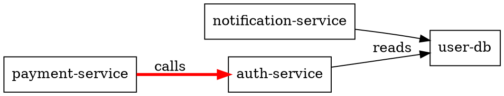

# Ultra Generator

## Purpose

Ultra Generator is an AI-powered analysis engine that performs deep, multi-dimensional analysis of codebases. It combines traditional static analysis tools with LLM-powered reasoning to produce actionable insights beyond line-by-line linting. The skill detects architectural anti-patterns, quantifies technical debt, identifies security vulnerabilities with exploit likelihood scoring, and generates comprehensive code health reports with specific refactoring recommendations.

Real use cases:
- Pre-acquisition codebase due diligence for M&A (generate 50-page technical assessment)
- Legacy system modernization planning (identify rewrite vs refactor candidates)
- Security posture audit with CWE mappings and proof-of-concept exploit suggestions
- Continuous architecture governance (detect drift from established patterns)
- Technical debt quantification for budgeting and sprint planning
- API contract compliance verification

## Scope

**Commands:**
- `ultra-gen analyze <path> [--depth=quick|deep|exhaustive] [--focus=security|architecture|performance|debt] [--output=json|markdown|pdf]` - Main analysis command
- `ultra-gen scan <path> --ruleset=<custom|owasp|nist|misra> --severity=high|medium|all` - Security-focused scan with vulnerability chaining analysis
- `ultra-gen patterns <path> --detect=anti-patterns|design-patterns|code-smells --min-confidence=0.7` - Pattern recognition with confidence scoring
- `ultra-gen debt <path> --calculate=cyclomatic|cognitive|maintainability --currency=USD --team-cost=150` - Technical debt monetization
- `ultra-gen report <path> --template=executive|engineering|board --include=dependencies|complexity|security|tests` - Multi-audience report generation
- `ultra-gen diff <commit1> <commit2> --analyze=complexity|security|architecture` - Comparative analysis between versions
- `ultra-gen architecture <path> --map=components|dependencies|data-flow` - Architecture diagram generation and violation detection
- `ultra-gen dependencies <path> --check=outdated|vulnerable|licenses|transitive` - Dependency risk analysis
- `ultra-gen test-coverage <path> --metric=branch|line|mutation --target=80` - Coverage gap analysis with AI-generated test suggestions
- `ultra-gen api-compliance <spec_path> <impl_path> --format=openapi|grpc|graphql` - API implementation conformance checking

**Flags:**
- `--depth` - Controls analysis intensity (quick: 2-5 min, deep: 15-30 min, exhaustive: 1-2 hours)
- `--focus` - Filters analysis to specific domains
- `--output` - Output format (json for pipelines, markdown for humans, pdf for deliverables)
- `--exclude` - Glob patterns to exclude (e.g., `--exclude="**/test/**"`)
- `--model` - Override default LLM model (e.g., `--model=claude-3-opus`)
- `--cache` - Enable/disable result caching (default: true)
- `--parallel` - Number of parallel file analysis workers (default: CPU count)
- `--context-window` - Maximum files to feed to LLM at once (default: 50)
- `--threshold` - Minimum severity/score to report (0.0-1.0)
- `--severity` - Filter security findings by severity level
- `--ruleset` - Security rule set to apply
- `--min-confidence` - Minimum confidence threshold for pattern detection
- `--currency` - Currency for debt calculation
- `--team-cost` - Hourly cost for technical debt monetization
- `--template` - Report template for audience
- `--include` - Sections to include in report
- `--format` - API specification format

## Work Process

### 1. Preparation Phase
- Validate environment variables (OPENAI_API_KEY or ANTHROPIC_API_KEY set, connectivity to provider)
- Scan filesystem for supported file types (.py, .js, .ts, .go, .rs, .java, .rb, etc.)
- Build language-specific parse trees using tree-sitter for structural analysis
- Generate file fingerprint (MD5 of content + mtime) for cache invalidation
- Load configuration from `~/.ultra/config.yaml` if exists
- Fallback: Use security-focused analysis without LLM if API keys unavailable (limited functionality)

### 2. Static Analysis Phase (Parallel Execution)
- Run bandit, radon, pylint, semgrep on all eligible files
- Collect: cyclomatic complexity, cognitive complexity, maintainability index, raw metrics (LOC, comment density)
- Identify: duplicated code blocks, dead code, security anti-patterns
- Build function call graph and import dependency matrix
- Detect: large classes (>500 LOC), long methods (>50 LOC), deep inheritance (>5 levels)
- Output: JSON artifacts in `~/.ultra/cache/<run-id>/static/`

### 3. LLM Analysis Phase
- Chunk codebase by logical modules (directories, import groups) respecting `--context-window`
- For each chunk, send to LLM with specialized prompts:
  * **Security Prompt**: "Analyze for vulnerabilities. Rate exploit likelihood 0-1. Suggest PoC."
  * **Architecture Prompt**: "Identify components, responsibilities, violations of SOLID/DDD."
  * **Debt Prompt**: "Quantify complexity, estimate remediation effort in days, prioritize."
  * **Pattern Prompt**: "Detect design patterns and anti-patterns with confidence scores."
- Include static analysis results as context to ground LLM reasoning
- Stream responses and aggregate into master analysis JSON
- Fallback: If LLM fails, mark LLM-dependent sections as "unavailable" and continue

### 4. Synthesis Phase
- Merge static + LLM results, resolve conflicts (LLM wins for semantic insights, static for metrics)
- Calculate technical debt: `(complexity_factor * remediation_time_hours * team_cost)`
- Prioritize findings: `severity_score * likelihood * impact_radius`
- Generate architecture component diagram in DOT format for Graphviz
- Detect security vulnerability chains (e.g., SQLi → authentication bypass → RCE)
- Build cross-reference index: "Function X called from 23 places, complexity 12, debt: $18,000"

### 5. Reporting Phase
- Load selected template (executive: 2-page summary, engineering: detailed with code snippets, board: risk heatmap)
- Populate template with synthetic data
- For markdown/PDF: embed code snippets with syntax highlighting
- For JSON: include full raw data for downstream processing
- Write to stdout or file (if `--output` specified)
- Generate executive summary with top 5 risks and remediation costs

## Golden Rules

1. **Never** modify source files - Ultra Generator is read-only
2. **Always** respect `.gitignore` - exclude patterns must be honored
3. **Cache aggressively** - identical runs within 24h must return cached results (unless `--no-cache`)
4. **Fail gracefully** - if LLM unavailable, produce partial report with "LLM insights unavailable" warnings
5. **Respect rate limits** - implement exponential backoff for API calls; limit to 10 req/min
6. **Sanitize secrets** - redact API keys, passwords, tokens from code before sending to LLM
7. **Validate LLM output** - parse JSON responses, retry on malformed output (max 3 attempts)
8. **Quote costs accurately** - technical debt calculation must include team cost and remediation time
9. **Preserve reproducibility** - log exact model, prompt, and seed used for each analysis
10. **Exit codes**: 0=success, 1=partial (static only), 2=config error, 3=dependency missing, 4=analysis failed

## Examples

### Example 1: Deep security audit of Python service
```bash
$ ultra-gen analyze ./myapp/auth-service \
  --depth=deep \
  --focus=security \
  --output=json \
  --exclude="**/test/**" \
  --model=claude-3-opus \
  --threshold=0.6
```

**Output:** `analysis-20240115-143022.json`
```json
{
  "run_id": "ultra-20240115-143022",
  "summary": {
    "total_files": 247,
    "vulnerabilities_high": 3,
    "vulnerabilities_medium": 12,
    "technical_debt_usd": 45000,
    "critical_path": ["untyped user input → SQL query → auth bypass"]
  },
  "findings": [
    {
      "id": "SEC-001",
      "file": "auth/middleware.py:45",
      "type": "SQL Injection",
      "severity": 0.92,
      "exploit_likelihood": 0.85,
      "llm_poC": "curl 'http://target/login' -d 'user=admin' --cookie 'session=1' OR 1=1--'",
      "static_bandit_id": "B608",
      "remediation": "Use parameterized queries. Estimated 4 hours.",
      "debt_usd": 6000
    }
  ],
  "architecture": {
    "violations": ["Auth service directly queries DB (bypasses repository)"],
    "cyclical_dependencies": false,
    "components": ["Auth", "User", "Session", "Audit"]
  }
}
```

### Example 2: Executive report for board meeting
```bash
$ ultra-gen report ./legacy-payment-system \
  --template=board \
  --include=security,dependencies,debt \
  --output=pdf \
  --team-cost=200 \
  --currency=EUR
```

**Output:** `board-report-20240115.pdf` (3 pages)
- Page 1: Risk heatmap (Critical: €125k, High: €280k, Medium: €450k)
- Page 2: Top 5 risks with business impact
- Page 3: 12-month remediation roadmap with quarterly budgets

### Example 3: API compliance check
```bash
$ ultra-gen api-compliance ./specs/api.yaml ./services/payment-service \
  --format=openapi \
  --output=markdown
```

**Output:**
```markdown
# API Compliance Report: OpenAPI → Implementation

## Violations (3)
1. **Missing endpoint**: `POST /v1/refunds` (spec requirement)
   - Spec: line 234
   - Recommendation: Implement idempotent refund endpoint

2. **Type mismatch**: `amount` field
   - Spec: `number` with minimum 0
   - Impl: `integer` (no validation)
   - Risk: Negative amounts accepted

3. ** undocumented error code**: 529 (returned but not documented)
```

### Example 4: Technical debt monetization with custom cost
```bash
$ ultra-gen debt ./monolith --calculate=cognitive --team-cost=180 --currency=USD --output=json
```

**Output snippet:**
```json
{
  "total_debt_usd": 2450000,
  "top_debt_items": [
    {
      "file": "legacy/utils.py",
      "function": "process_data",
      "cognitive_complexity": 42,
      "remediation_days": 14,
      "debt_usd": 50400,
      "suggested_refactor": "Split into 5 smaller functions with single responsibilities"
    }
  ]
}
```

### Example 5: Pattern detection with confidence threshold
```bash
$ ultra-gen patterns ./go-project --detect=anti-patterns --min-confidence=0.85 --output=markdown
```

**Output:**
```markdown
## Detected Anti-Patterns

### God Object (Confidence: 0.91)
- **Location**: `internal/service/orchestrator.go:23`
- **Issue**: Single struct with 47 fields, 89 methods
- **Impact**: Violates Single Responsibility, high merge conflicts
- **Refactor**: Split into `OrderOrchestrator`, `PaymentOrchestrator`, `InventoryOrchestrator`
```

### Example 6: Architecture drift detection
```bash
$ ultra-gen architecture ./microservices --map=dependencies --output=dot > arch.dot
$ dot -Tpng arch.dot -o arch.png
```

**Generated `arch.dot`:**


## Dependencies and Requirements

**System dependencies:**
- Python 3.9+ with pip
- Graphviz (for DOT diagram rendering)
- Git (for diff analysis)
- Node.js 18+ (for JavaScript/TypeScript analysis via ESLint if needed)

**Installation:**
```bash
pip install ultra-generator[all]
# or with extras for specific languages:
pip install ultra-generator[python,javascript,go,security]
```

**Configuration file** `~/.ultra/config.yaml`:
```yaml
cache:
  enabled: true
  ttl_hours: 24
  dir: ~/.ultra-cache

llm:
  provider: openai  # or anthropic
  model: gpt-4-turbo-preview
  timeout: 300
  max_retries: 3
  backoff_factor: 2

analysis:
  exclude:
    - "**/test/**"
    - "**/node_modules/**"
    - "**/.git/**"
  parallel_workers: auto
  context_window: 50

security:
  rulesets: [bandit, semgrep, owasp]
  min_severity: 0.5

debt:
  team_cost_usd_per_hour: 150
  currency: USD
  include_penalties: false

report:
  default_template: engineering
  include_snippets: true
  max_snippet_lines: 20
```

**Environment variables:**
- `ULTRA_MODEL` - Override default LLM model (e.g., `claude-3-opus-20240229`)
- `ULTRA_TIMEOUT` - API timeout in seconds (default: 300)
- `ULTRA_CACHE_DIR` - Cache directory override
- `ULTRA_MAX_WORKERS` - Parallel worker limit
- `ULTRA_LOG_LEVEL` - DEBUG, INFO, WARNING, ERROR
- `OPENAI_API_KEY` - OpenAI API key (if using OpenAI)
- `ANTHROPIC_API_KEY` - Anthropic API key (if using Anthropic)
- `ULTRA_DISABLE_CACHE` - Set to "1" to disable caching

## Verification

After running any analysis:
1. Check exit code: `echo $?` should be 0 for full success
2. Verify output file exists: `ls -lh analysis-*.json` (or markdown/pdf)
3. Validate JSON structure: `jq . analysis-*.json > /dev/null && echo "Valid JSON"`
4. Check for completeness: `jq '.findings | length' analysis-*.json` should be non-zero
5. For security scans: ensure `vulnerabilities_high` count matches expectation
6. Verify no secrets leaked: `grep -i 'password\|secret\|token' analysis-*.json || echo "No secrets"`
7. Cache validation: re-run identical command; should return "cache hit" in logs
8. For PDF reports: `file report-*.pdf` should show PDF format

**Quick health check:**
```bash
ultra-gen --version
ultra-gen analyze . --depth=quick --output=json --timeout=60
```

## Troubleshooting

**Issue: "API key not found"**
- **Cause**: Neither OPENAI_API_KEY nor ANTHROPIC_API_KEY set
- **Fix**: `export OPENAI_API_KEY="sk-..."` or set in `~/.ultra/config.yaml`
- **Workaround**: Run with `--no-llm` flag for static-only analysis

**Issue: "Rate limit exceeded"**
- **Cause**: Too many LLM requests in short time
- **Fix**: The skill auto-retries with exponential backoff; wait 60 seconds and retry
- **Prevent**: Set `--parallel=1` for smaller codebases; increase backoff in config

**Issue: "Context window overflow"**
- **Cause**: Too many files in single LLM request (large monolith)
- **Fix**: Reduce `--context-window` to 20 or use `--exclude` to narrow scope
- **Alternative**: Run multiple focused analyses: `--focus=security` then `--focus=architecture`

**Issue: "Malformed LLM output"**
- **Cause**: LLM returned non-JSON or truncated response
- **Fix**: Auto-retry up to 3 times; if persists, run with `--model=claude-3-opus` (more reliable JSON)
- **Debug**: Set `ULTRA_LOG_LEVEL=DEBUG` and inspect `~/.ultra/cache/<run-id>/llm_raw.txt`

**Issue: "Out of memory during analysis"**
- **Cause**: Large codebase overloaded parallel workers
- **Fix**: Limit workers: `--parallel=2` or set `ULTRA_MAX_WORKERS=2`
- **Monitor**: Check RAM usage with `htop` during run

**Issue: "Cache corruption"**
- **Cause**: Interrupted write or disk full
- **Fix**: Clear cache: `rm -rf ~/.ultra/cache/*` and re-run
- **Prevent**: Ensure 10% free disk space; use SSD for cache dir

**Issue: "Missing language support"**
- **Cause**: Tree-sitter grammar not installed for language
- **Fix**: Install language extras: `pip install ultra-generator[ruby]` or `[rust]`
- **Check**: `ultra-gen --list-languages`

**Issue: "Security scan too slow"**
- **Cause**: Semgrep rule set exhaustive (1000+ rules)
- **Fix**: Use `--ruleset=custom` with curated rules or `--severity=high` only
- **Speedup**: Disable with `--no-semgrep` (still runs bandit)

**Issue: "PDF generation failed"**
- **Cause**: WeasyPrint or wkhtmltopdf not installed
- **Fix**: `apt-get install weasyprint` or use `--output=markdown`
- **Alternative**: `pandoc report.md -o report.pdf`

## Rollback Commands

**If analysis produced incorrect/false positive findings:**
1. **Invalidate cache for specific run**:
   ```bash
   # Find run ID in filename or cache directory
   rm -rf ~/.ultra/cache/ultra-20240115-143022
   ```

2. **Revert to previous known-good configuration**:
   ```bash
   # Restore config from backup
   cp ~/.ultra/backups/config-20240114.yaml ~/.ultra/config.yaml
   ```

3. **Remove generated reports**:
   ```bash
   rm -f analysis-*.json analysis-*.md report-*.pdf arch.dot
   ```

4. **If LLM model changed and caused regressions**:
   ```bash
   # Edit config to lock model
   sed -i 's/model: .*/model: gpt-4-turbo-preview/' ~/.ultra/config.yaml
   # Clear all cached LLM responses (keeps static analysis)
   find ~/.ultra/cache -name "llm_*.json" -delete
   ```

5. **Full reset (warning: deletes all cached analysis)**:
   ```bash
   rm -rf ~/.ultra/cache
   ultra-gen doctor --fix  # Recreates directories with correct permissions
   ```

6. **Emergency: disable LLM entirely** (pure static analysis):
   ```bash
   # Temporary
   ultra-gen analyze . --no-llm
   # Permanent (edit config)
   echo "llm:\n  enabled: false" >> ~/.ultra/config.yaml
   ```

7. **Restore from Git if codebase changed during analysis**:
   ```bash
   # If Ultra modified files (it shouldn't, but for safety)
   git checkout -- .
   git clean -fd
   ```

**No rollback needed for:** Read-only operations (source files untouched). Only cached results and config may need cleanup.
```